<div align="center">

# 🔍 Agentic Search Intelligence

**Ask a question about a brand. Get back an evidence-backed answer about where it shows up — in Google, and inside AI assistants.**


*Five specialist AI agents, one directed graph, and a failure path for every step.*

</div>

---

## 🧭 Start here: what problem does this solve?

Imagine you run marketing for an SEO tool called **Surfer SEO**. You want to know:

> *"When people search for our category — or ask ChatGPT about it — do we show up?"*

Today, answering that means opening ten browser tabs, running searches by hand,
asking ChatGPT the same question four times, writing numbers into a spreadsheet,
and guessing what to do about it. It takes an afternoon, and it is stale tomorrow.

**This system does it in under half a minute and shows its working.**


### 🎁 What actually comes out

This is **real, unedited output** from `make demo`:

```
Search and AI visibility review for Surfer SEO (surferseo.com).

Queries analysed: 4. Visible: 2. Not visible: 0. Could not be checked: 2.

Highest-opportunity queries:
  - surfer seo alternative       (opportunity 0.574, 590 searches/mo,  difficulty 28, not checked)
  - seo content optimization     (opportunity 0.557, 2400 searches/mo, difficulty 52, not checked)
  - What are the best SEO tools? (opportunity 0.49,  n/a searches/mo,  difficulty n/a, visible in AI answers)
  - best seo tool                (opportunity 0.339, 8100 searches/mo, difficulty 74, #3)
  Queries marked "not checked" have provisional scores: no SERP lookup covered
  them, so their visibility is unverified.

Key findings:
  - Strong presence for high-volume branded queries: Surfer SEO ranks in
    position 3 for 'best seo tool', indicating solid brand recognition.
  - Presence in AI answers for general SEO tools queries: the brand is visible
    for 'What are the best SEO tools?', showing AI answer inclusion.

Recommended content:
  - [medium] Surfer SEO Alternatives: How We Compare (comparison_page)
      Captures users searching for alternatives — 590 monthly searches.
```

Look at the fourth column. It says **"not checked"**, not "not ranking". That
distinction is the difference between an honest report and a confident wrong
one, and [a whole section below](#-three-bugs-worth-writing-up) explains why it
took a bug to get right.

---

## ⚡ Quick start

Requires Python 3.12 and [uv](https://docs.astral.sh/uv/). **No API keys are
needed to run everything below.**

```bash
git clone <this-repo> && cd agentic-search-intel
cp .env.example .env        # add LLM credentials if you want live reasoning
make install
make test                   # 293 tests, no credentials, no network
make demo                   # full pipeline against mock data, prints the report
```

| Command | What it does | Needs credentials? |
|---|---|:---:|
| `make test` | Run all 293 tests | ❌ |
| `make demo` | Full pipeline run, prints the report | LLM only |
| `make demo-failure` | Watch retries, backoff and fallback happen | ❌ |
| `make run` | Start the API on `localhost:8000` | LLM only |
| `make lint` | Style and type checks | ❌ |
| `make clean` | Remove the local database and caches | ❌ |

Then drive it over HTTP:

```bash
# 1. register a brand
curl -X POST localhost:8000/api/v1/profiles \
  -H 'Content-Type: application/json' \
  -d '{"name":"Surfer SEO","domain":"surferseo.com","industry":"SEO Software",
       "competitors":["clearscope.io","marketmuse.com"]}'

# 2. run the pipeline (10-20s)
curl -X POST localhost:8000/api/v1/profiles/<profile_uuid>/run \
  -H 'Content-Type: application/json' -d '{}'
```

Interactive API docs at **`http://localhost:8000/docs`**.

---

## 🧠 How it works — the five specialists

The core idea: **no single agent does everything.** Each one has exactly one job
and is forbidden from doing the others. That is what makes failures diagnosable —
when something goes wrong, exactly one agent is responsible.

Think of it as a small research team passing a folder down a desk:

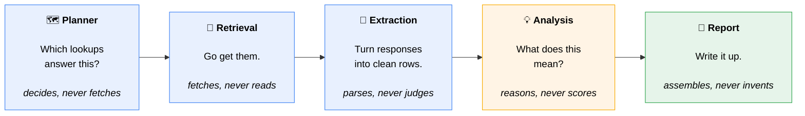

| Agent | Sole responsibility | Never does | Enforced by |
|---|---|---|---|
| `query_planner` | Decide which lookups answer the question | Fetch anything | `test_planner_does_not_fetch_anything` |
| `retrieval` | Execute planned calls, return raw responses | Parse or reshape | `test_response_is_returned_unmodified` |
| `extraction` | Parse responses into normalized rows | Call an API, interpret | `test_node_does_not_normalize` |
| `analysis` | Reason over normalized data | Retrieve, parse, assign scores | `test_model_supplied_priority_is_ignored` |
| `report` | Assemble JSON + summary | Reason, invent findings | `test_planner_writes_only_its_own_keys` |
| `fallback` | Record *why* the pipeline degraded | Produce findings | `test_total_retrieval_failure_diverts_to_fallback` |

> **The separation is tested, not just claimed.** Every row above names a test
> that fails if an agent starts doing someone else's job.

### The real graph, including every escape hatch

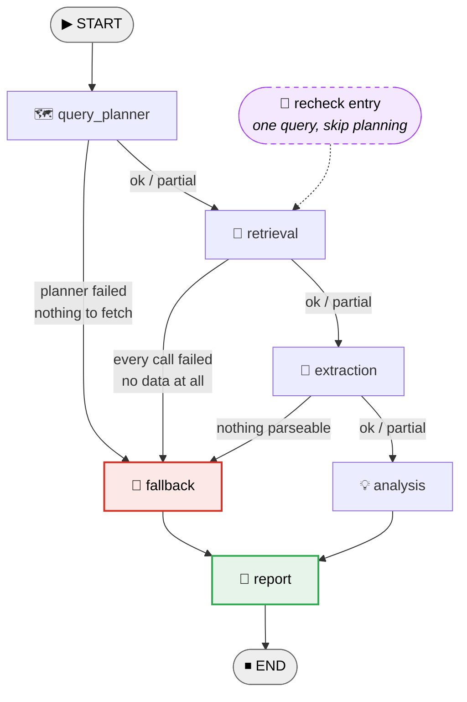

**Three conditional edges can divert to the fallback path.** The fallback
records *why* the run degraded, then the report node still assembles whatever is
available. A partial run returns an explained gap — never an empty response,
never a crash.

The dashed purple line is `POST /queries/{uuid}/recheck`: it enters the graph at
**retrieval**, skipping the planner entirely, reusing the tool call stored
alongside that query.

### One question, end to end

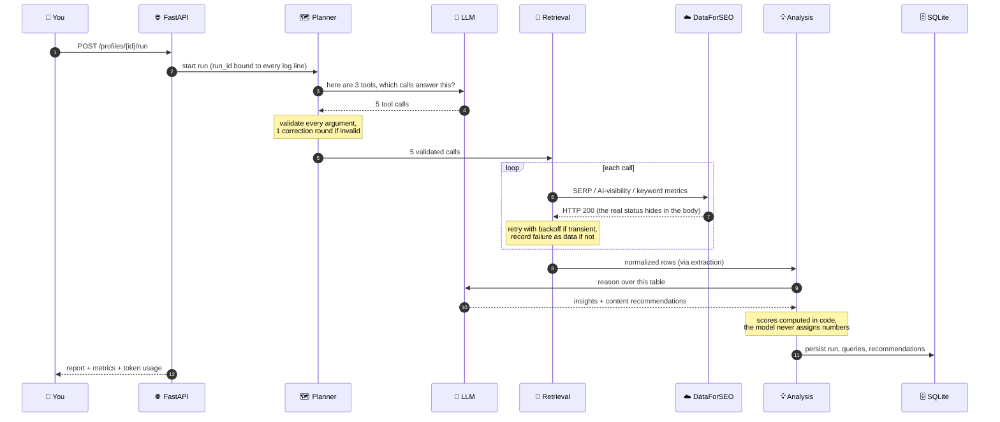

---

## 🧰 The three tools

The planner is not free to call anything. It gets exactly three tools, each
mapping to one logical DataForSEO call:

| Tool | Answers | Endpoint |
|---|---|---|
| 🔎 `serp_organic_lookup` | *Does the domain rank in Google, and where?* | `/v3/serp/google/organic/live/advanced` |
| 🤖 `llm_visibility_lookup` | *Is the brand named or cited in an AI answer?* | `/v3/ai_optimization/{platform}/llm_responses/live` |
| 📈 `keyword_metrics_lookup` | *How much search volume, how hard to rank?* | `/v3/dataforseo_labs/google/keyword_overview/live` |

### The model chooses *intent*; code supplies *mechanism*

This is the single most important design rule in the tool layer.

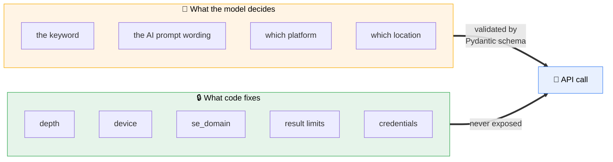

Two reasons, both learned the expensive way:

- **💸 Cost.** Expose `depth` and a hallucinated `depth=700` spends real money on
  a live key. The model cannot spend what it cannot reach.
- **🧨 Brittleness.** Constrained vocabularies use `Literal`, so `location: "UK"`
  is rejected *by the schema* with a readable message, instead of becoming a
  task-level `40501` error from the API twenty seconds later.

`extra="forbid"` on every schema means a hallucinated parameter is a validation
failure the planner can be *told about* — not a field silently dropped on the floor.

### Validation is a returned result, not an exception

`validate_tool_call()` returns a `ToolCallResult` instead of raising, and its
error strings are written **for a model to read**:

```
location: Input should be 'United Kingdom', 'United States', 'Canada', 'Australia' or 'Germany'
```

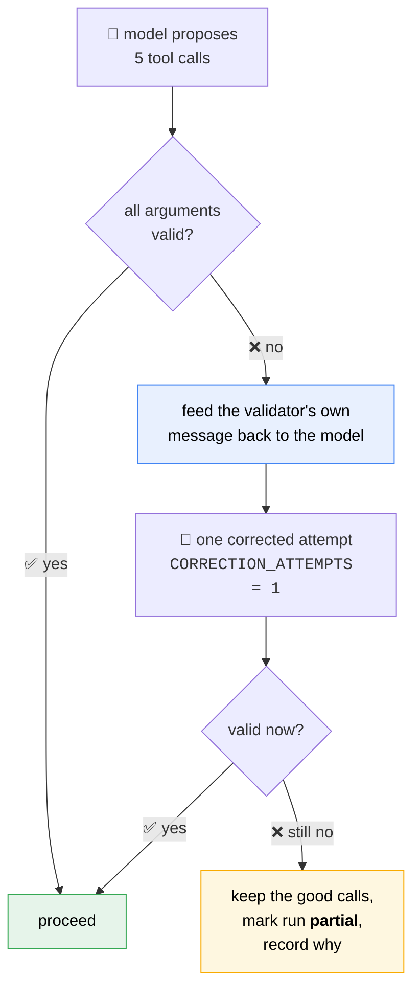

The loop is **bounded at one retry on purpose**. An unbounded correction loop is
an unbounded bill.

**Arguments are re-validated at the retrieval boundary too.** That looks
redundant until you remember `/recheck` loads a call *out of the database* — and
anything that has been through persistence is untrusted input again.
`test_corrupted_args_are_caught_without_calling_the_api` asserts the API is never
touched when that second check fails.

### Coverage gaps: when a prompt is not a guarantee

The planner is *told* to always include one keyword-metrics call. A prompt is a
request, not a contract. When the model skips it, there are three options:

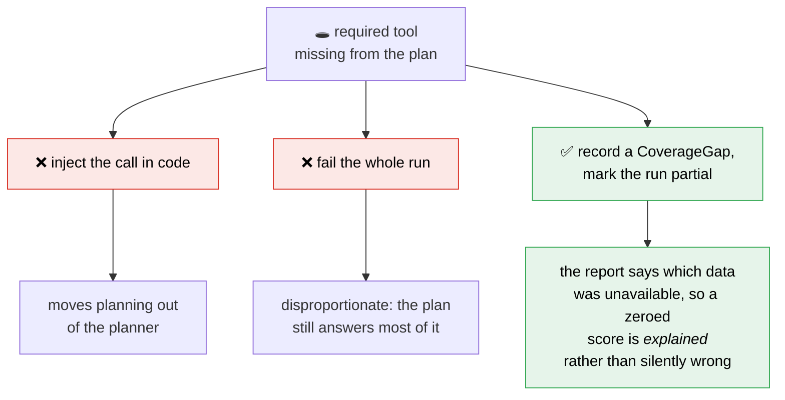

Gaps deliberately do **not** trigger the correction round. The model was already
told; asking twice costs another API call and rarely changes the answer.
Validation errors get a retry because the model can *act* on the validator's
message. A coverage gap is a decision it already made.

---

## 🛡️ Failure handling

> **The design assumption: everything external fails eventually.** The question
> is never *will this break* but *what does the user see when it does*.

### The trap: DataForSEO returns HTTP 200 for almost everything

This is the single nastiest thing about the upstream API, and it breaks naive clients.

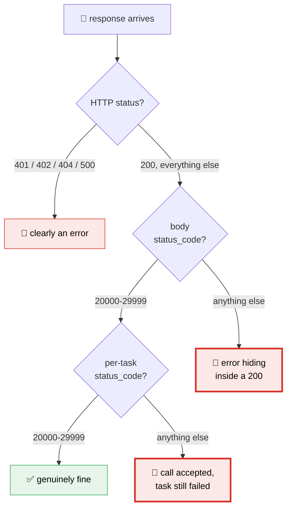

**There are two levels of body status**: a top-level code for whether the call
was *accepted*, and a per-task code for whether that task actually *produced data*.

So `response.raise_for_status()` is close to useless here. A client built on HTTP
codes alone treats failures as successes and passes empty payloads downstream —
which surfaces three agents later as "no results found" instead of "auth is
broken". `app/dataforseo/classify.py` checks all three layers;
`test_http_200_with_body_error_still_raises` covers the trap.

### Not every error deserves a retry

Retryability is a property of the **exception type**, so the retry runner asks
the error rather than re-inspecting HTTP codes at each call site.

| ♻️ Retry these | 🛑 Never retry these |
|---|---|
| `TransportError` — timeout, connection reset | `AuthError` — 401, your key is wrong |
| `RateLimitError` — 429, back off and try again | `PaymentRequiredError` — 402, you are out of credit |
| `ServerError` — 5xx, or body `status_code >= 50000` | `BadRequestError` — 400/404, our request is malformed |
| `TaskError` — known transient upstream codes | |

Task codes **do not split cleanly by range**, which is the sort of detail you
only find by reading the docs properly: `40501` ("Invalid Field") is *our* bug
and must not be retried, while `40101` ("Internal SE Server Error") is transient
and should be. Range classification is the default, with an explicit
`RETRYABLE_TASK_CODES` set for the known exceptions.

### Exponential backoff with full jitter

`RetryPolicy(max_attempts=3, base_delay=0.5, max_delay=8.0)` — all configurable
via `.env`.

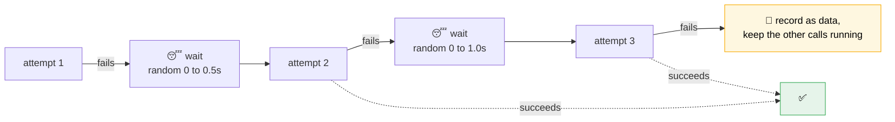

**Why *full jitter* rather than a fixed backoff?** Because a fixed curve makes
every client retry at the same instant. A service that has just come back up
gets hit by a synchronised thundering herd and falls over again. Drawing each
delay uniformly from `[0, window]` spreads them out.

`sleep` is **injected**, so tests assert on the backoff curve without waiting
for it. A suite covering three- and four-attempt sequences spends no real time
sleeping — `test_backoff_window_grows_and_is_capped` and
`test_jitter_produces_different_delays` assert on the delay values themselves.

### Degradation, not collapse

One failed call does not kill the others:

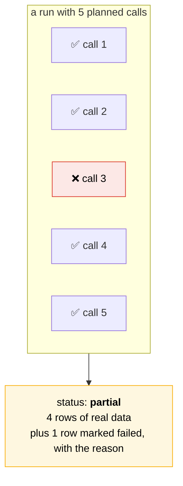

Failed calls **still produce a row**. Otherwise a failed query would be
indistinguishable from one that was never planned, and would silently vanish
from `/queries` — the user would never know something was missing.

### See it for yourself: `make demo-failure`

Three scenarios against a scriptable mock client. Abridged real output:

<details>
<summary><b>1️⃣ Transient failure, recovered by retry</b> — the caller never notices</summary>

```
[info ] node_completed  node=retrieval calls_succeeded=5 calls_failed=0 status=ok
[info ] run_summary     api_calls=5 retries=2 success_rate=1.0

retrieval status : ok
attempts on SERP : [3, 1, 1, 1, 1]
-> the run completed normally; the caller never saw the failures
```
</details>

<details>
<summary><b>2️⃣ Non-retryable failure</b> — fails fast instead of burning the budget</summary>

```
SERP calls made  : 2 (2 planned calls x 1 attempt each)
retrieval status : partial
error recorded   : AuthError: 401 Unauthorized
-> one attempt only, despite max_attempts=3
```
</details>

<details>
<summary><b>3️⃣ Total failure</b> — routes around the dead agents, still reports</summary>

```
[info ] node_completed  node=retrieval calls_succeeded=0 calls_failed=5 status=failed
[info ] node_completed  node=fallback  reason='Every retrieval call failed, so
                                              there was no data to analyse.'
[info ] node_completed  node=report    status=partial

nodes visited  : query_planner -> retrieval -> fallback -> report
overall status : partial
```

**`extraction` and `analysis` never executed.** The conditional edge routed
around them, and a report was still produced explaining the gap.
</details>

Covered by `test_scripted_transient_failure_then_recovery`,
`test_non_retryable_failure_is_marked_as_such`, and
`test_total_retrieval_failure_diverts_to_fallback`.

---

## 🔭 Observability

The design target was a specific question:

> *Given only the logs, could someone woken at 3am answer **which node failed,
> why, whether it was retryable, how many attempts it made, how long each node
> took, and which external calls happened** — without leaking the API password?*

### Every line carries the same `run_id`

Bound via context variables, so **one `grep` reconstructs an entire pipeline
execution** even with concurrent runs interleaved in the same log stream.

### A real trace

Captured from an actual run — not an illustration:

```json
{"node": "query_planner", "inputs": {"question": "How does Surfer SEO show up in AI answers and search results for its category?", "domain": "surferseo.com"}, "event": "node_started", "run_id": "a4aba499-161a-4355-a176-8844d96b583d", "level": "info", "timestamp": "2026-09-09T05:18:50.210197Z"}
{"node": "query_planner", "duration_ms": 3502.82, "retrieval_calls_planned": 5, "tool_calls_rejected": 0, "coverage_gaps": 0, "status": "ok", "event": "node_completed", "run_id": "a4aba499-...", "level": "info"}
{"node": "retrieval", "duration_ms": 1.93, "calls_succeeded": 5, "calls_failed": 0, "status": "ok", "event": "node_completed", "run_id": "a4aba499-...", "level": "info"}
{"node": "extraction", "duration_ms": 0.45, "records_normalized": 4, "responses_parsed": 5, "responses_unparsable": 0, "status": "ok", "event": "node_completed", "run_id": "a4aba499-...", "level": "info"}
{"node": "analysis", "duration_ms": 10538.61, "insights": 3, "recommendations": 4, "status": "ok", "event": "node_completed", "run_id": "a4aba499-...", "level": "info"}
{"run_id": "a4aba499-...", "nodes_executed": 5, "nodes_ok": 5, "nodes_failed": 0, "success_rate": 1.0, "total_duration_ms": 14044.97, "node_latency_ms": {"query_planner": 3502.82, "retrieval": 1.93, "extraction": 0.45, "analysis": 10538.61, "report": 1.16}, "api_calls": 5, "api_calls_succeeded": 5, "api_calls_failed": 0, "api_call_paths": ["/v3/ai_optimization/chat_gpt/llm_responses/live", "/v3/ai_optimization/perplexity/llm_responses/live", "/v3/serp/google/organic/live/advanced", "/v3/serp/google/organic/live/advanced", "/v3/dataforseo_labs/google/keyword_overview/live"], "retries": 0, "total_tokens": 1912, "event": "run_summary", "level": "info"}
```

Read that last line and you know the entire run: **5 nodes, all ok, 14 seconds,
where the time went (analysis: 10.5s, because it is the LLM), which 5 endpoints
were called, zero retries, 1,912 tokens.**

A failure line carries the classification that explains the retry behaviour:

```json
{"node": "retrieval", "error_type": "AuthError", "error": "401 Unauthorized", "retryable": false, "event": "node_failed", "run_id": "d1ee55ab-...", "level": "error"}
```

`retryable: false` is the field that turns *"it broke"* into *"it broke and
retrying will not help you, go fix the key"*.

### Redaction that keeps the shape

Sensitive keys — `password`, `login`, `api_key`, `token`, `credential`,
`authorization`, `secret` — are replaced recursively and case-insensitively.
Real output from `scripts/demo_logs.py`:

```json
{"node": "retrieval", "inputs": {"keyword": "best seo tool", "password": "***redacted***"}, "event": "node_started", "level": "info"}
```

**The key is preserved on purpose.** Knowing that a password field *was present
and non-empty* is exactly what you need when debugging an auth failure — and it
is what a naive "drop the whole key" redactor destroys.

A whole sensitive *block* is replaced wholesale rather than walked into, so a new
secret nested under `auth` is covered automatically without anyone remembering to
add it to the list.

### For production

- 📡 Ship traces to **OpenTelemetry or LangSmith** instead of parsing logs, so
  spans nest properly and node latency becomes queryable across runs.
- 📊 Export counters to **Prometheus** (`node_duration_seconds`,
  `api_calls_total{tool,outcome}`, `retries_total{error_type}`) and alert on
  **fallback rate** and **non-retryable error rate** — the two signals that
  separate *"the external API is flaky"* from *"our config is broken"*.
- 💾 Sample and persist **raw API responses for failed runs**. The logs record
  that parsing failed, but not what arrived.
- 🧠 Log the **LLM's raw tool-call output** on validation failure, to tell a bad
  prompt apart from a bad schema.

---

## 🌐 The API

All endpoints return JSON. No auth layer, per the brief.

| Method | Path | Purpose |
|---|---|---|
| `POST` | `/api/v1/profiles` | Register a brand profile → `201` |
| `GET` | `/api/v1/profiles/{uuid}` | Profile plus run stats |
| `POST` | `/api/v1/profiles/{uuid}/run` | Execute the full DAG |
| `GET` | `/api/v1/profiles/{uuid}/queries` | Latest run's queries, best opportunity first |
| `GET` | `/api/v1/profiles/{uuid}/recommendations` | Content recommendations, priority ordered |
| `POST` | `/api/v1/queries/{uuid}/recheck` | Re-run one query without re-planning |
| `GET` | `/health` | Liveness plus active DataForSEO mode |

`/queries` supports `?min_score=`, `?status=visible|not_visible|unknown`, and
`?page=&per_page=`. **Pagination reports the full matching total**, not just the
page size — otherwise a client cannot tell page 3 of 3 from page 3 of 30.

**Status codes:** `201` create · `404` unknown profile or query · `422` invalid
input · `409` rechecking a query that has no retrieval call of its own (rows
derived from a keyword batch).

### Data model

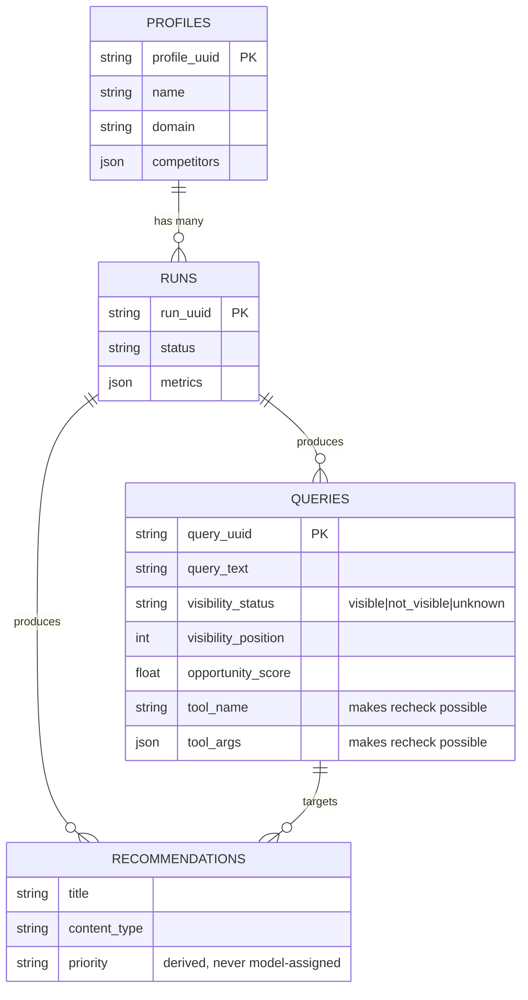

SQLite via SQLAlchemy, with foreign keys and cascade deletes. **`queries` stores
the tool name and arguments that produced each row** — that one design choice is
what makes `/recheck` possible without re-planning.

Runs are synchronous, as the brief permits. A run takes 10-20 seconds, almost all
of it LLM latency.

### 🚦 Visibility is three-state, and that matters

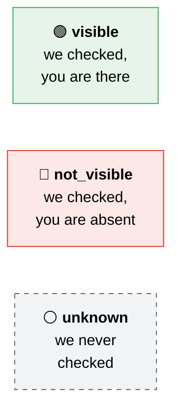

The third value is the one that earns its keep. A query whose SERP lookup failed
is **not** the same as one where the brand genuinely does not rank. Collapsing
them reports *"you are not ranking"* when the truth is *"we could not check"* — a
confident, wrong, and actionable-in-the-wrong-direction claim. `domain_visible`
is derived from this field rather than being a second, disagreeing source of truth.

### 🎯 The opportunity score

The formula is ours to define. Three weighted components, always in `[0, 1]`:

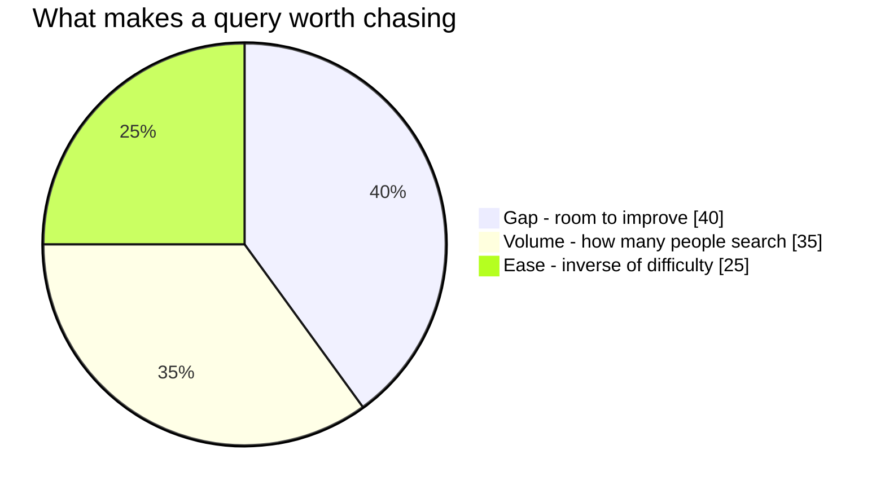

| Component | Weight | Why |
|---|:---:|---|
| **Gap** | `0.40` | Heaviest. A query you already rank #1 for is *not* an opportunity, however big. |
| **Volume** | `0.35` | Log-scaled: 100 to 1,000 matters far more than 10,000 to 11,000. |
| **Ease** | `0.25` | Inverse of keyword difficulty. |

The gap component in detail:

| Your position | Gap score | Reading |
|---|:---:|---|
| Not visible | `1.00` | Wide open |
| Position 11+ | `0.60` | Page two, real headroom |
| Position 4-10 | `0.30` | Close, worth a push |
| Position 1-3 | `0.00` | Already won |
| **Unknown** | **`0.50`** | **Neutral — a failed check must never *inflate* a score** |

That last row is deliberate. Scoring `1.0` for unknown would let a broken lookup
manufacture a top priority out of nothing.

> **🔑 The LLM never assigns a number.** Scores are computed deterministically in
> code; the model writes *prose* — insight titles, rationales, content angles —
> and priority is derived from the score by threshold. Letting the model set
> priority would create a second source of truth that visibly contradicts the
> score printed next to it. `test_model_supplied_priority_is_ignored` enforces this.

---

## ⚙️ Configuration

### DataForSEO mode

> **This submission runs in `mock` mode by default** — fixtures under
> `app/dataforseo/fixtures/` whose structure matches real DataForSEO responses.
> No account, no network, no credentials. Clone and run.

| Mode | Behaviour | Credentials |
|---|---|:---:|
| `mock` *(default)* | Fixtures, no network, scriptable failures | ❌ |
| `sandbox` | Real HTTP to `sandbox.dataforseo.com`, sample data, not billed | ✅ |
| `live` | Real HTTP to `api.dataforseo.com`, real data, **billed** | ✅ |

`sandbox` and `live` need `DATAFORSEO_LOGIN` and `DATAFORSEO_PASSWORD` (the API
password from the dashboard, *not* the account password). The factory raises a
clear error rather than letting you discover it as a confusing 401.

### LLM provider

Azure AI Foundry via its OpenAI-compatible `/openai/v1` endpoint, using
`gpt-4.1-mini`. **All model access goes through a single `get_llm()` function**,
so swapping providers is a one-file change.

---

## 📁 Project structure

```
app/
├── config.py              typed settings from .env
├── llm.py                 single point of LLM construction
│
├── dataforseo/            🌩️  the untrusted outside world
│   ├── errors.py          error taxonomy with retryability baked in
│   ├── classify.py        HTTP + two-level body status classification
│   ├── retry.py           exponential backoff with full jitter
│   ├── client.py          httpx transport, timeouts, per-request auth
│   ├── mock.py            scriptable stand-in, identical interface
│   ├── factory.py         mode selection
│   └── fixtures/          realistic DataForSEO response shapes
│
├── tools/                 🧰  what the model is allowed to ask for
│   ├── schemas.py         Pydantic argument schemas + validation
│   └── executors.py       one executor per logical API call
│
├── nodes/                 🤖  the five agents
│   ├── planner.py         agent 1 — decides
│   ├── retrieval.py       agent 2 — fetches
│   ├── extraction.py      agent 3 — parses
│   ├── parsers.py         defensive response parsing
│   ├── scoring.py         opportunity formula (deterministic)
│   ├── analysis.py        agent 4 — reasons
│   └── report.py          agent 5 — assembles
│
├── graph/                 🕸️  how the agents connect
│   ├── state.py           typed state with append reducers
│   ├── routing.py         conditional edge functions
│   ├── nodes.py           dependency injection + fallback node
│   ├── build.py           DAG construction
│   └── status.py          overall run status derivation
│
├── observability/         🔭  what happened, and why
│   ├── logging.py         structlog config, redaction, correlation IDs
│   └── metrics.py         node spans and run metrics
│
├── db/                    🗄️  persistence
│   ├── models.py          four tables
│   ├── repository.py      state <-> row translation
│   └── session.py         engine and transactional scope
│
└── api/                   🌐  the front door
    ├── schemas.py         request/response shapes
    ├── routes.py          endpoints
    ├── service.py         orchestration shared by /run and /recheck
    └── main.py            FastAPI app

scripts/                   smoke test and demonstration entry points
tests/                     293 tests
```

### State and reducers

A single typed `PipelineState` flows through the graph. `raw_results` and
`errors` use an **append reducer**, so concurrent branches accumulate instead of
overwriting each other. Failures are recorded **as data** (`StageError`,
`RawResult.status`) rather than raised — which is precisely what lets the
conditional edges route on them.

---

## 🧪 Testing

```bash
make test        # 293 tests, no credentials or network required
```

| Requirement | Tests |
|---|---|
| Happy-path run | `test_full_run_completes`, `test_full_run_visits_every_agent` |
| Simulated failure with retry | `test_scripted_transient_failure_then_recovery`, `test_transient_server_error_is_retried_then_succeeds` |
| Fallback path | `test_total_retrieval_failure_diverts_to_fallback`, `test_failed_planner_skips_retrieval_entirely` |
| Tool-call validation | `tests/test_schemas.py` — 14 tests |

**Some tests exist to protect the architecture, not the behaviour:**

- `test_response_is_returned_unmodified` fails if an executor starts parsing.
- `test_mechanism_params_are_not_exposed_to_the_llm` fails if someone adds
  `depth` to a schema "just for convenience".
- `test_every_schema_has_an_executor` fails if the two registries drift apart.

The whole suite runs **without credentials** because mock mode is a first-class
citizen, not an afterthought. A reviewer can clone and run immediately.

**On runtime:** wall-clock is dominated by *import* cost, not test work —
`pytest --collect-only` accounts for nearly all of it, because importing
`app.api.main` pulls in the langchain and Azure client stack. The slowest
individual test is ~1.4s and most are under 0.3s. Expect the suite to feel
fast or slow depending on filesystem cache and machine load, not on anything
the tests are doing.

---

## 🐛 Three bugs worth writing up

Every design decision below was prompted by something that actually went wrong.
These are the three most instructive.

### 1. Auth belongs to the request, not the connection

Basic auth was originally set on the `httpx.Client` in the constructor. That
works — until someone injects their own client, as the tests do and as any caller
wanting a custom transport would. Then credentials are **silently dropped** and
every request 401s while the config plainly contains valid ones.

> **The rule:** anything that must be true of *every* call belongs **at** the
> call, not in the object's construction. Constructor-time configuration is
> invisible to whoever substitutes the object, and it fails quietly.

The test caught this **only** because it asserted on the outgoing `Authorization`
*header*. Had it checked `client._auth`, it would have passed while the code was
broken.

### 2. Catch-all handlers make your bugs look like someone else's

The analysis node wraps its LLM call in a broad `except Exception` so a provider
outage degrades the run instead of crashing it. During development,
`SYSTEM_PROMPT.format()` raised `KeyError` — the prompt contains a literal JSON
example, and `str.format` treats `{` as a format field.

That **programming error** was dutifully recorded as a `StageError` and the node
reported `failed`. Graceful degradation, wrapped neatly around a bug in our own code.

The only reason it was diagnosable is that the log records `error_type`, not just
a message. That is the concrete argument for logging exception *types*. The cost
is real and listed under limitations: the handler still cannot tell a transient
provider failure from a bug in prompt assembly.

### 3. Tests verify the code does what you told it — not that you were right

The pipeline ran **green**. Every test passed. And the report said
`Not visible: 0` on one line while listing three queries as *"not ranking"* on the next.

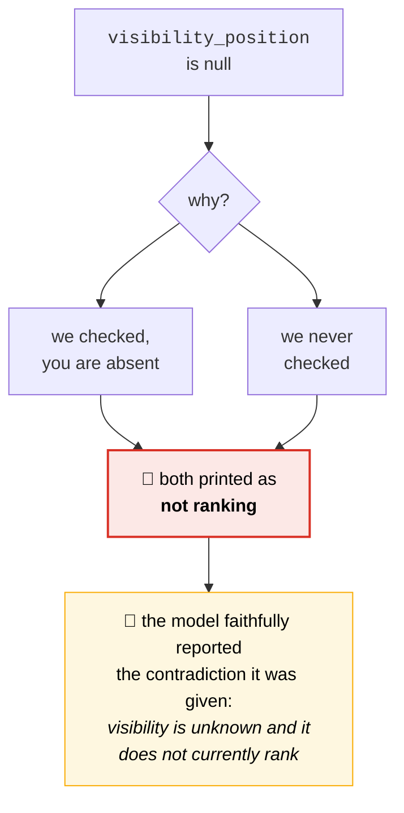

Separately, AI-visibility queries were passed to the model as
`0 searches/mo, difficulty 0` — so it reasoned about volume data that **does not
exist** for a conversational prompt. Those now render as `n/a`.

**Both fixes came from reading the output, not from a failing test.** The
three-state `visibility_status` field exists because of this. Every row label is
now derived from the same field the header counts, so the two *cannot* disagree.

### Bonus: the test suite poisoned itself

Adding the API tests broke **ten** unrelated tests in four other files — and only
in one specific order.

`TestClient` runs the app's lifespan, which calls `configure_logging()` with
`cache_logger_on_first_use=True`. structlog then caches bound loggers
permanently, and every later reconfiguration silently has no effect. The
log-capture fixture could no longer intercept anything.

The tell was **which** tests survived: the ones calling `structlog.get_logger()`
inside the test body still passed, because they get a fresh proxy each time. Only
tests routing through a *module-level* logger failed.

> Caching is now off by default. It saved a trivial per-call cost and bought an
> irreversible global in exchange. **Global mutable configuration is what makes
> test suites order-dependent.**

---

## ⚠️ Known limitations

Stated plainly, because a submission that claims no weaknesses is not being read
carefully.

| Limitation | Impact |
|---|---|
| **Retrieval is sequential** | The `merge_lists` reducer is already correct for concurrent branches, but calls run in a loop. A five-call run spends ~25s against the live API where ~6s would do. |
| **No circuit breaker** | The §3.5 bonus is not implemented. Every run re-attempts a dependency that has been failing consistently. |
| **Domain matching is exact** | `blog.surferseo.com` counts as *not visible* for `surferseo.com`. Real entity resolution needs a brand-to-domain map, not string matching. |
| **`average_opportunity_score` is a lifetime average** | It drifts as runs accumulate, while `/queries` shows only the latest run. The brief is ambiguous; scoping both to the latest run would be more consistent. |
| **Unchecked queries can outrank checked ones** | A query with good fundamentals that no SERP call covered scores above one where the brand genuinely ranks #3. The summary discloses this, but the score itself is not confidence-weighted. |
| **The analysis exception handler is too broad** | As described above — it cannot tell a provider outage from our own bug. |
| **Fixtures are hand-written** | They match documented response shapes but were not captured from live traffic. Parsers are defensive and return `None` rather than raising, but a contract test against recorded responses would be better. |
| **Runs are synchronous** | Acceptable per the brief, but a 20-second HTTP request is not a production pattern. |
| **Location vocabulary is a hardcoded subset** | Five countries, rather than loading and caching DataForSEO's locations endpoint. |
| **Startup side effects are global** | The API tests boot the real app through `TestClient`, so logging config and `init_db()` really execute. A production setup would make logging injectable and build the app through a factory. |

---

## 🗺️ What I would do next

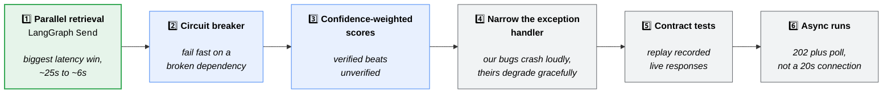

1. **True fan-out for retrieval** using LangGraph's `Send`. The state reducer is
   already built for it — this is the single largest latency win and the change
   is contained to `build.py`.
2. **Circuit breaker** around the DataForSEO client, tripping after N consecutive
   exhausted failures, so a broken dependency fails fast instead of burning the
   retry budget on every run.
3. **Confidence-weighted opportunity scores**, damping unchecked queries so
   verified opportunities outrank unverified ones at equal fundamentals. This is
   a product decision as much as a code change — it needs a stakeholder
   conversation, not a magic multiplier slipped into the formula.
4. **Narrow the LLM exception handler** to the provider's own exception types, so
   genuine programming errors crash loudly in development while provider failures
   still degrade gracefully in production.
5. **Contract tests against recorded live responses**, captured once from the
   sandbox and replayed, so parser assumptions are checked against reality rather
   than against fixtures we wrote ourselves.
6. **Async execution** with a task queue — return `202` with a run UUID and a
   status endpoint to poll.

Beyond that: OpenTelemetry tracing, **competitor comparison as a first-class
feature** (competitors are captured on the profile but currently only used as
prompt context), and **historical trend tracking** across runs, so `/recheck` can
report *movement* rather than just current state.

---

<div align="center">

**Built with** LangGraph · FastAPI · Pydantic · structlog · SQLAlchemy · httpx

*Every number in this README was measured, and every test name cited exists.*

</div>
